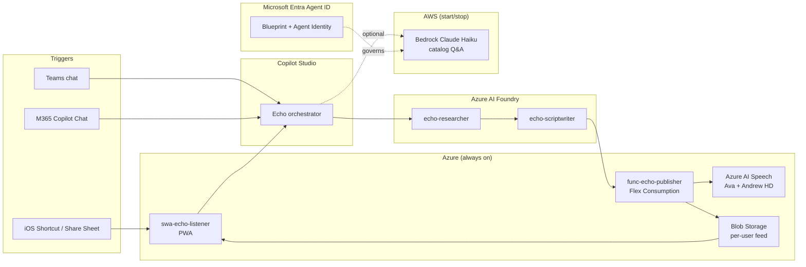

# Echo — Build Kit

A multi-agent system that turns a URL into a 12-minute two-host podcast (Ava + Andrew) and publishes it to a private feed you listen to on a PWA. Built on the Microsoft AI stack — Copilot Studio, Azure AI Foundry, Azure AI Speech — with an optional cross-cloud Q&A agent on AWS Bedrock, governed end-to-end by Microsoft Entra Agent ID.

## What's in this folder

| File | What it is | Where it goes |
|------|------------|---------------|
| `01-orchestrator-agent.md` | Copilot Studio agent: instructions, topics, connections | Copilot Studio agent designer |
| `02-foundry-agents.md` | Researcher + Scriptwriter agents | Azure AI Foundry → Agents |
| `03-custom-connectors-openapi.md` | OpenAPI specs for Publisher + Bedrock catalog | Copilot Studio → Custom connectors |
| `04-github-copilot-prompts.md` | Vibe-code prompts for Publisher, PWA, share-sheet | GitHub Copilot Chat |
| `05-ssml-template.md` | Two-host SSML pattern for Ava + Andrew | Reference for Scriptwriter |
| `06-demo-storyboard.md` | 7-minute customer demo script + talking points | Rehearsal |
| `07-bedrock-catalog-agent.md` | AWS CDK + Lambda catalog Q&A agent (start/stop) | AWS account |
| `08-m365-copilot-surfaces.md` | Declarative Agent + API Plugin for M365 Copilot | M365 Agents Toolkit |
| `09-entra-agent-id-setup.md` | Register the AWS agent under Entra Agent ID | Microsoft Graph |
| `10-cost-and-ops.md` | Per-episode cost model + start/stop runbooks | Reference |
| `infra/` | Bicep modules for the full Azure environment | `az deployment` |

## Architecture at a glance

## Build order

1. **Provision Azure infra** with Bicep — see `infra/main.bicep`. Creates `rg-echo-prod` in Sweden Central, references the shared `law-uksouth` Log Analytics workspace.
2. **Build the Publisher Function App** — lowest layer, every agent calls it. Prompts in `04-github-copilot-prompts.md`.
3. **Build the PWA Listener** — lets you verify end-to-end before agents exist (manually upload an MP3, check it appears in the feed).
4. **Build the Foundry agents** — Researcher first, then Scriptwriter. Spec in `02-foundry-agents.md`.
5. **Build the Copilot Studio orchestrator** — wire to Foundry agents + custom connectors. Spec in `01-orchestrator-agent.md`.
6. **Publish to Teams + DirectLine.**
7. **Wire the iOS Shortcut** to the SWA `/api/share` endpoint.
8. **(Optional) Build the M365 Copilot surfaces** — Declarative Agent + API Plugin. Spec in `08-m365-copilot-surfaces.md`.
9. **(Optional) Build the Bedrock catalog Q&A agent** — `cdk deploy` to spin up, `cdk destroy` to spin down. Spec in `07-bedrock-catalog-agent.md`.
10. **(Optional) Register under Entra Agent ID** — see `09-entra-agent-id-setup.md`.
11. **Rehearse with `06-demo-storyboard.md`.**

## Naming convention

Use `echo-` prefix on every resource for easy filtering:

| Kind | Name |
|---|---|
| Resource group | `rg-echo-prod` |
| Region | Sweden Central (Speech may fall back to West Europe — see `10-cost-and-ops.md`) |
| Storage | `stechoprod<suffix>` |
| Speech | `spch-echo-prod` |
| Function App | `func-echo-publisher` |
| Static Web App | `swa-echo-listener` |
| App Insights | `appi-echo-prod` (workspace-based → shared `law-uksouth`) |
| Key Vault | `kv-echo-prod-<suffix>` |
| Foundry project | `aif-echo-prod` |
| AWS S3 (catalog) | `echo-catalog-<suffix>` (eu-central-1) |
| AWS Lambda | `echo-catalog-qa` |

## Out of scope for v1

- WhatsApp / Azure Communication Services trigger (parked — re-evaluate after first 50 episodes)
- Custom domain (defaults `*.azurestaticapps.net` and `*.azurewebsites.net` for v1)
- Bedrock Knowledge Base / OpenSearch (saves ~$175/mo always-on; in-context catalog fits under 200 episodes)

## License

MIT — see `LICENSE`. Contributions welcome; see `CONTRIBUTING.md`.
